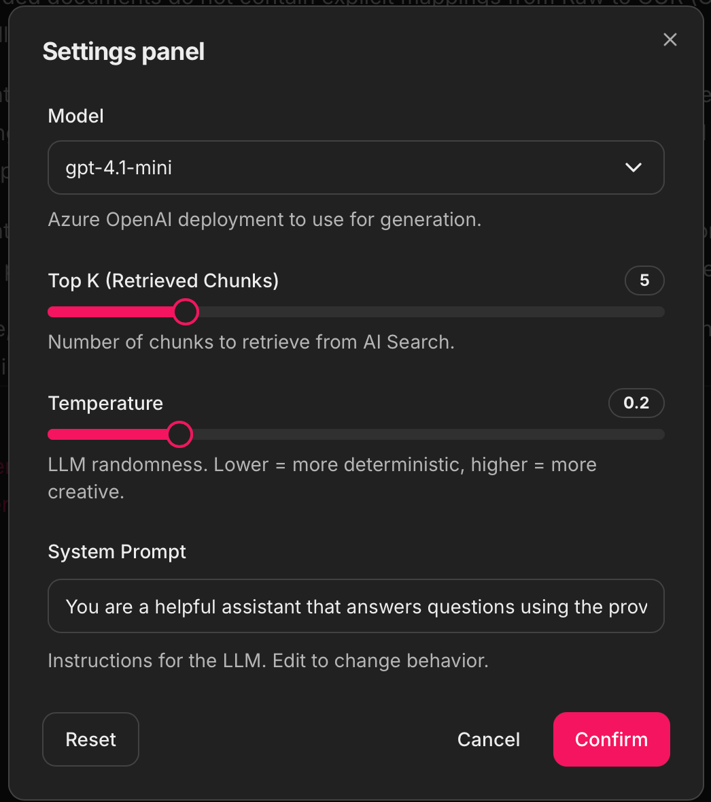
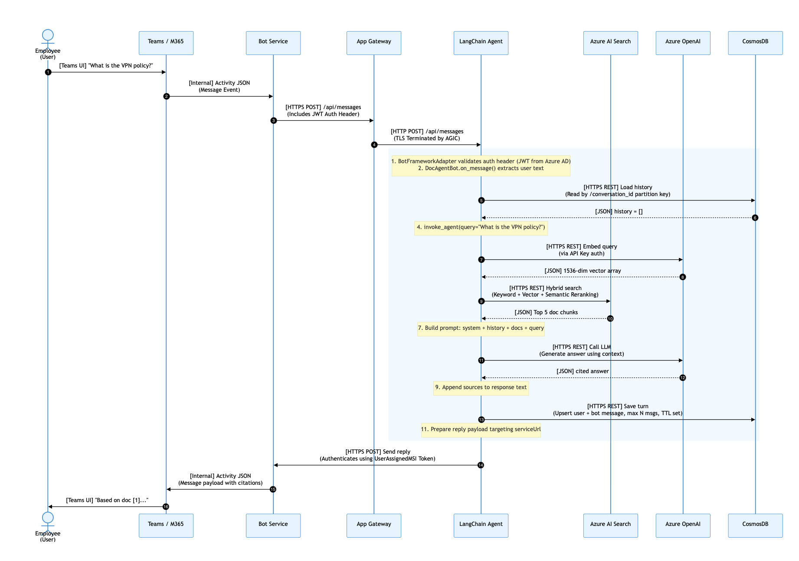

# M365 LangChain Agent

Enterprise RAG agent for Microsoft 365. Answers employee questions from the internal knowledge base with citation-backed responses, deployed as a single container on Azure Container Apps.

**Stack:** Python 3.10 | LangChain | Azure Bot Service | CosmosDB | Azure AI Search | Azure OpenAI (GPT-4.1)

**Architecture:** Single container — **1 replica**, no Redis/Postgres, no LangGraph. CosmosDB handles conversation state.

> Full architecture with C4 diagrams: **[ARCHITECTURE.md](docs/ARCHITECTURE.md)**

---

## Table of Contents

- [Quick Start](#quick-start)
- [User Interfaces](#user-interfaces)
  - [Bot Service Mode](#bot-service-mode-default)
  - [Chainlit UI Mode](#chainlit-ui-mode)
- [Chainlit Settings Panel](#chainlit-settings-panel)
- [Debug Panel](#debug-panel)
- [RAG Pipeline — How It Works](#rag-pipeline--how-it-works)
- [Deployment](#deployment)
- [Feature Flags](#feature-flags)
- [Environment Variables](#environment-variables)
- [Project Structure](#project-structure)
- [AI Foundry Integration](#ai-foundry-integration)
- [Operational Commands](#operational-commands)
- [Screenshots](#screenshots)
- [Prerequisites](#prerequisites)

---

## Quick Start

```bash
# 1. Install
cd m365-langchain-agent
python3 -m venv .venv && source .venv/bin/activate
pip install -r requirements.txt

# 2. Configure
cp .env.example .env    # Fill in your Azure resource values

# 3. Run (Bot Service mode — default)
python app.py

# 4. Run (Chainlit UI mode)
USER_INTERFACE=CHAINLIT_UI python app.py
# Open http://localhost:8080/chat/

# 5. Verify
curl http://localhost:8080/health
# {"status":"healthy","service":"m365-langchain-agent"}
```

---

## User Interfaces

The agent supports two user interface modes, controlled by the `USER_INTERFACE` environment variable. Both modes share the same FastAPI app with `/health`, `/readiness`, and `/test/query` endpoints.

### Bot Service Mode (default)

`USER_INTERFACE=BOT_SERVICE`

Exposes `POST /api/messages` for Azure Bot Service. Messages from Teams, WebChat, and DirectLine are routed to the RAG agent. Responses include inline citation links that render as clickable markdown in Teams.

**What happens behind the scenes:**
1. Azure Bot Service sends an Activity JSON to `/api/messages`
2. `BotFrameworkAdapter` validates the auth header (supports both client-secret and **User-Assigned MSI**)
3. `DocAgentBot.on_message_activity()` extracts the user text
4. Conversation history is loaded from CosmosDB
5. `invoke_agent()` runs the full RAG pipeline (search + generate)
6. Response with citation links is sent back through Bot Service
7. Turn is saved to CosmosDB for multi-turn context

**MSI Authentication:** When `BOT_APP_ID` is set but `BOT_APP_PASSWORD` is empty, the agent automatically uses `MsiBotFrameworkAdapter` — a custom adapter that overrides the SDK's token acquisition to use `ManagedIdentityCredential`. This is required because the botbuilder-python SDK does not natively support User-Assigned MSI.

### Chainlit UI Mode

`USER_INTERFACE=CHAINLIT_UI`

Browser-based chat interface mounted at `/chat/` (root `/` redirects to `/chat/`). Provides a rich development and demo experience with:

- **Dynamic settings panel** — adjust model, temperature, top K, system prompt at runtime
- **Model selection** — switch between GPT-4.1, GPT-4.1-mini, o3-mini (or any configured models)
- **Inline debug accordions** — view retrieved chunks, full LLM prompt, active settings
- **Clickable source citations** — links to original SharePoint/Wiki documents
- **Conversation history** — multi-turn context via CosmosDB (same as Bot Service mode)

---

## Chainlit Settings Panel

The settings panel (gear icon in the Chainlit sidebar) lets you adjust agent behavior at runtime without restarting the container. All settings take effect on the **next message** you send.



| Setting | Type | Default | Range | Description |
|---------|------|---------|-------|-------------|
| **Model** | Dropdown | `gpt-4.1` | Configured models | Azure OpenAI deployment to use. Models listed in `AZURE_OPENAI_AVAILABLE_MODELS` env var (comma-separated). |
| **Top K** | Slider | `5` | 1 -- 20 | Number of chunks to retrieve from Azure AI Search. Higher = more context but slower and more tokens. |
| **Temperature** | Slider | `0.2` | 0.0 -- 1.0 (step 0.05) | LLM randomness. Lower = more deterministic and factual, higher = more creative. Ignored for reasoning models (o1, o3). |
| **System Prompt** | Text Input | Default RAG prompt | Free text | Full system instructions for the LLM. Edit to change citation style, tone, or domain focus. |

**How settings work behind the scenes:**
1. On chat start, `@cl.on_chat_start` creates `ChatSettings` with the widgets above and stores them in `cl.user_session`
2. When you change a setting, `@cl.on_settings_update` fires and updates the session
3. On each message, `@cl.on_message` reads current settings from the session and passes them to `invoke_agent()` as `top_k`, `temperature`, `system_prompt`, and `model_name` parameters
4. `invoke_agent()` uses these overrides (or falls back to defaults from env vars)

**Model-specific behavior:**
- Standard models (GPT-4.1, GPT-4.1-mini) respect the temperature setting
- Reasoning models (o1-\*, o3-\*) require API version `2024-12-01-preview` and ignore temperature (it's not a supported parameter). The agent detects this automatically via `_is_reasoning_model()` and adjusts the API call.

---

## Debug Panel

Every response in Chainlit UI includes three expandable debug accordions (collapsible `Step` elements attached to the message):

### 1. Retrieved Chunks (N)

Shows the raw search results from Azure AI Search:

| Field | Description |
|-------|-------------|
| **Query** | The exact user query sent to search |
| **Index** | The AI Search index name (`AZURE_SEARCH_INDEX_NAME`) |
| **Chunks retrieved** | Count and top_k value used |

For each chunk:

| Field | Description |
|-------|-------------|
| **Search Score** | BM25 keyword match score |
| **Reranker Score** | Semantic reranker score (when semantic config is set) |
| **Source Type** | Origin of the document (e.g., `sharepoint`, `wiki`) |
| **Chunk** | Position within the source document (e.g., `3 of 12`) |
| **PII Redacted** | Whether the ingestion pipeline redacted PII |
| **Source URL** | Link to the original document |
| **Content** | Full chunk text in a code block |

### 2. Full LLM Prompt

The complete prompt sent to Azure OpenAI, including:
- `=== SYSTEM PROMPT ===` — the system instructions (default or custom)
- `=== USER PROMPT (with context) ===` — the user question + all numbered document contexts

This lets you see exactly what the LLM receives, debug prompt issues, and verify that the right chunks are being injected.

### 3. Settings Used

A table of the active configuration for that specific response:

| Setting | Example Value |
|---------|---------------|
| **Model** | `gpt-4.1` |
| **Top K** | `5` |
| **Temperature** | `0.2` |
| **System Prompt** | _Default_ or _Custom_ |
| **Index** | The configured search index |
| **Sources Found** | `4` |
| **Raw Chunks** | `5` |

---

## RAG Pipeline — How It Works

The agent follows a simple **Search -> Deduplicate -> Generate** pipeline with no graph orchestration:

```
User Question
      |
      v
  [1] Azure AI Search (hybrid: keyword + vector + semantic)
      |  - Embeds query via text-embedding-3-small (1536d)
      |  - Runs hybrid search: BM25 keyword + HNSW cosine vector + semantic reranker
      |  - Returns top_k chunks with scores, metadata, and content
      v
  [2] Deduplicate Sources
      |  - Groups chunks from the same document (by source_url)
      |  - Keeps the highest-scoring chunk per document
      v
  [3] Build Context
      |  - Formats documents as numbered context: [1] (Source: title)\n{content}
      |  - Prepends conversation history (last 3 exchanges from CosmosDB)
      v
  [4] Generate Answer (Azure OpenAI GPT-4.1)
      |  - System prompt enforces citation rules: [1], [2], etc.
      |  - Refuses to hallucinate -- says "knowledge base does not contain..."
      v
  [5] Return Structured Result
      |  - answer: The LLM response text
      |  - sources: List of Source dicts with title, URL, scores, preview
      |  - raw_chunks: All retrieved chunks (for debug panel)
      |  - full_prompt: Complete prompt sent to LLM (for debug panel)
      v
  [6] Save Turn to CosmosDB
      - Appends user + assistant messages to conversation history
      - Keeps last 20 messages (10 turns), 24h TTL
```

### Search Details

The search client (`utils/search.py`) performs **three-way hybrid search** in a single API call:

1. **Keyword (BM25):** Full-text search on `chunk_content` using `en.microsoft` analyzer
2. **Vector (HNSW):** Cosine similarity on `content_vector` (1536d from text-embedding-3-small)
3. **Semantic Reranker:** Cross-encoder reranking using the semantic configuration

All three are combined by Azure AI Search's fusion algorithm. The semantic reranker score (when available) is used for source deduplication and display.

### Source URL Normalization

The agent normalizes source URLs from the ingestion pipeline. ADLS blob URLs are converted to clean relative paths. Proper HTTP URLs (SharePoint, wiki) are kept as-is.

---

## Deployment

### Azure Container Apps

Managed deployment — no cluster required. Requires Azure resources (OpenAI, Search, CosmosDB) to already exist.

```bash
# Configure your environment
cp .env.example .env   # Fill in your Azure resource values

# Deploy
chmod +x deploy-container-apps.sh
./deploy-container-apps.sh
```

**What it does:**
1. Registers `Microsoft.App` + `Microsoft.OperationalInsights` providers
2. Creates a Container Apps Environment
3. Creates the Container App with external ingress (port 8080)
4. Sets all env vars (OpenAI, Search, CosmosDB, Bot, LangSmith)
5. Outputs the FQDN and runs a health check

### Manual Deployment

Build and push the image manually, then update the Container App:

```bash
# Build (AMD64)
docker buildx build --platform linux/amd64 \
  -t <acr-name>.azurecr.io/m365-langchain-agent:latest .

# Push
az acr login --name <acr-name>
docker push <acr-name>.azurecr.io/m365-langchain-agent:latest

# Update Container App
az containerapp update \
  --name m365-langchain-agent \
  --resource-group <rg> \
  --image <acr-name>.azurecr.io/m365-langchain-agent:latest
```

---

## Feature Flags

The agent behavior is controlled by environment variables that act as feature flags:

### `USER_INTERFACE`

| Value | Behavior |
|-------|----------|
| `BOT_SERVICE` (default) | FastAPI + Bot Framework adapter at `/api/messages`. No browser UI. |
| `CHAINLIT_UI` | FastAPI + Chainlit mounted at `/chat/`. Root `/` redirects to `/chat/`. Settings panel + debug accordions enabled. |

### `LANGCHAIN_TRACING_V2`

| Value | Behavior |
|-------|----------|
| `true` | All LLM calls, search queries, and agent invocations are traced to LangSmith. Requires `LANGSMITH_API_KEY`. |
| `false` (default) | No tracing. LangSmith is not contacted. |

### `AZURE_OPENAI_AVAILABLE_MODELS`

Comma-separated list of Azure OpenAI deployment names shown in the Chainlit model selector dropdown. If not set, defaults to `[<AZURE_OPENAI_DEPLOYMENT_NAME>, gpt-4.1, gpt-4.1-mini, o3-mini]`.

```bash
# Example: only show two models in the UI
AZURE_OPENAI_AVAILABLE_MODELS=gpt-4.1,gpt-4.1-mini
```

---

## Environment Variables

All configuration is externalized. See [.env.example](.env.example) for the full list with comments.

| Group | Variables | Required |
|-------|-----------|----------|
| **Azure OpenAI** | `AZURE_OPENAI_ENDPOINT`, `AZURE_OPENAI_DEPLOYMENT_NAME`, `AZURE_OPENAI_API_VERSION`, `AZURE_OPENAI_EMBEDDING_DEPLOYMENT` | Yes |
| **Azure AI Search** | `AZURE_SEARCH_ENDPOINT`, `AZURE_SEARCH_INDEX_NAME`, `AZURE_SEARCH_SEMANTIC_CONFIG_NAME`, `AZURE_SEARCH_EMBEDDING_FIELD` | Yes |
| **CosmosDB** | `AZURE_COSMOS_ENDPOINT`, `AZURE_COSMOS_DATABASE`, `AZURE_COSMOS_CONTAINER` | Yes |
| **Bot Framework** | `BOT_APP_ID`, `BOT_APP_PASSWORD` (empty for MSI), `BOT_AUTH_TENANT` | Bot mode only |
| **AI Foundry** | `AZURE_FOUNDRY_ENDPOINT`, `AZURE_FOUNDRY_SUBSCRIPTION_ID`, `AZURE_FOUNDRY_RESOURCE_GROUP`, `AZURE_FOUNDRY_WORKSPACE` | Foundry registration only |
| **LangSmith** | `LANGSMITH_API_KEY`, `LANGCHAIN_TRACING_V2`, `LANGCHAIN_PROJECT` | Optional |
| **Application** | `USER_INTERFACE`, `SHOW_CHAT_SETTINGS`, `DEFAULT_TOP_K`, `DEFAULT_TEMPERATURE`, `LOG_LEVEL`, `PORT` | No (have defaults) |
| **CosmosDB Tuning** | `COSMOS_TTL_SECONDS` (default: 86400), `COSMOS_MAX_MESSAGES` (default: 20) | No |

---

## Project Structure

```
m365-langchain-agent/
├── app.py                     # Entry point: FastAPI app + mode routing (Chainlit UI / Bot Service)
│                              #   + MsiBotFrameworkAdapter (custom MSI auth for Bot SDK)
├── m365_langchain_agent/
│   ├── bot.py                 # Bot Framework ActivityHandler -- bridges Bot Service <> agent
│   ├── agent.py               # LangChain RAG pipeline: search -> deduplicate -> generate
│   │                          #   + model selection, reasoning model detection, source building
│   ├── chainlit_app.py        # Chainlit UI: settings panel + debug accordions + citations
│   ├── cosmos_store.py        # CosmosDB conversation history (get/save, TTL, max messages)
│   ├── foundry_register.py    # AI Foundry agent registration via REST API
│   └── utils/
│       └── search.py          # Azure AI Search hybrid client (keyword + vector + semantic)
├── scripts/
│   └── register_foundry_agent.py   # CLI wrapper for foundry_register.py
├── deploy-container-apps.sh   # Container Apps deployment (resources must exist)
├── Dockerfile                 # Python 3.10-slim, single-stage
├── docs/
│   ├── ARCHITECTURE.md        # C4 diagrams (Context -> Container -> Component -> Code)
│   └── images/                # Screenshots and diagrams (add yours here)
│       └── sequence-diagram.png
├── requirements.txt
├── pyproject.toml
└── .env.example               # All env vars with descriptions
```

---

## AI Foundry Integration

The agent can be registered in Azure AI Foundry for publishing to M365 Copilot and Teams via the Foundry agent marketplace.

### What It Does

Registration creates an "assistant" in the Foundry Agents API with:
- **Model:** GPT-4.1 deployment
- **Tool:** Azure AI Search (hybrid: vector + semantic) connected to your index
- **Instructions:** System prompt for citation-backed answers

### How to Register

```bash
# Via CLI script
python scripts/register_foundry_agent.py

# List registered agents
python scripts/register_foundry_agent.py --list

# Delete an agent
python scripts/register_foundry_agent.py --delete <agent-id>
```

### How It Works Behind the Scenes

1. `foundry_register.py` builds the Foundry Agents REST API URL from env vars (`AZURE_FOUNDRY_ENDPOINT`, `AZURE_FOUNDRY_SUBSCRIPTION_ID`, etc.)
2. Gets a bearer token via `DefaultAzureCredential` (scoped to `https://ml.azure.com/.default`)
3. POSTs to `{base_url}/assistants?api-version=2024-12-01-preview` with the agent definition
4. The agent definition includes an `azure_ai_search` tool pointing to your index connection

---

## Operational Commands

```bash
# Health check
curl -sk https://<fqdn>/health

# Readiness check
curl -sk https://<fqdn>/readiness

# Test query (bypasses Bot Framework auth -- for debugging the full RAG pipeline)
curl -X POST https://<fqdn>/test/query \
  -H "Content-Type: application/json" \
  -d '{"query": "your question here"}'

# Test query with overrides
curl -X POST https://<fqdn>/test/query \
  -H "Content-Type: application/json" \
  -d '{"query": "your question", "model": "gpt-4.1-mini", "top_k": 10, "temperature": 0.5}'

# Logs (Container Apps)
az containerapp logs show --name m365-langchain-agent --resource-group <rg> --follow

# Restart (Container Apps)
az containerapp revision restart --name m365-langchain-agent --resource-group <rg> --revision <revision-name>

# Revisions
az containerapp revision list --name m365-langchain-agent --resource-group <rg> -o table

# Foundry agent management
python scripts/register_foundry_agent.py          # Register
python scripts/register_foundry_agent.py --list    # List agents
python scripts/register_foundry_agent.py --delete <agent-id>
```

---

## Screenshots

> **Add your screenshots to `docs/images/` and reference them below.**
>
> Suggested screenshots to capture:
> - Chainlit UI chat with source citations
> - Settings panel (gear icon) with model / temperature / top-k controls
> - Debug accordion: Retrieved Chunks expanded
> - Debug accordion: Full LLM Prompt expanded
> - Debug accordion: Settings Used expanded
> - Teams conversation with citation links

<!-- Uncomment and update paths as you add screenshots:

### Chainlit Chat UI


### Settings Panel


### Debug Panel -- Retrieved Chunks


### Debug Panel -- Full LLM Prompt


### Debug Panel -- Settings Used


-->

### Sequence Diagram


---

## Prerequisites

| Resource | Purpose |
|----------|---------|
| Azure Container Apps | Container hosting |
| Azure Container Registry | Docker image storage |
| Azure OpenAI | LLM (GPT-4.1) + embeddings (text-embedding-3-small) |
| Azure AI Search | Hybrid search index (keyword + vector + semantic) |
| Azure Bot Service | Teams / WebChat / DirectLine channel routing |
| Azure CosmosDB | Conversation state persistence (serverless, 24h TTL) |
| User-Assigned Managed Identity | Bot auth without client secrets |
| AI Foundry Hub + Project | Agent registration for M365 Copilot publishing (optional) |

**Local development tools:** Python 3.10+, Docker Desktop, Azure CLI (`az`)
